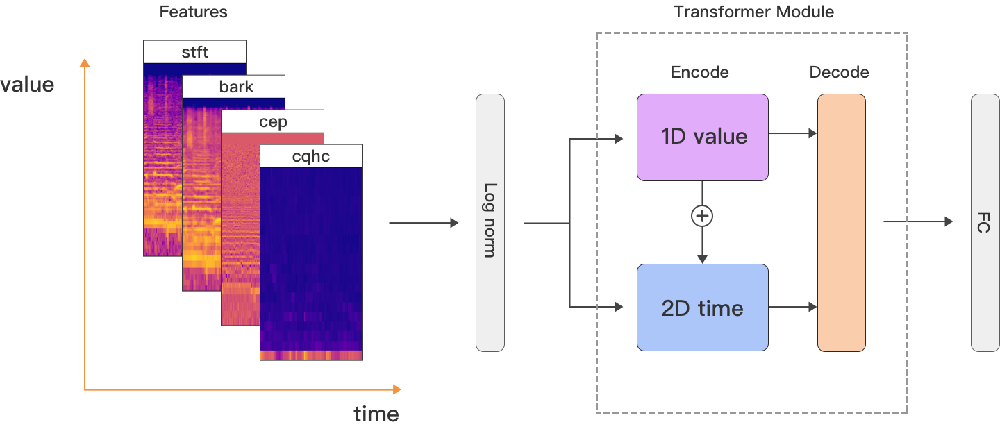
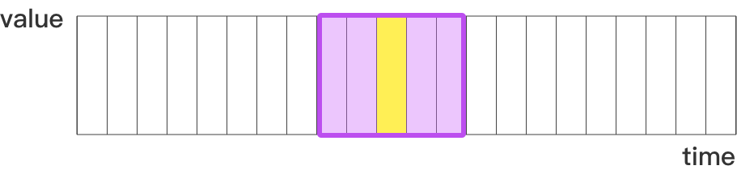

# TuneNN
A transformer-based network model, pitch tracking for musical instruments. 

The timbre of musical notes is the result of various combinations and transformations of harmonic relationships, harmonic strengths and weaknesses, instrument resonant peaks, and structural resonant peaks over time.   

> The online experience based on web audio and tensorflow.js, [See the site here](https://aifasttune.com)  

 

- **STFT spectrum**,  the most primitive spectrum, can accurately reflect the harmonic relationships and strengths of harmonics in musical notes. 
- **Bark spectrum**, more accurate than Mel spectrum in accordance with psychoacoustic perception of the human ear, is a nonlinear compression of the STFT spectrum. It belongs to a psychoacoustic abstraction feature that focuses on the harmonic relationships and strengths.   
- **Cepstrum**,  the envelope characteristics of instrument resonant peaks.
- **CQHC**,  MFCC features are designed to address pitch variations in speech. Based on CQT, CQCC can better reflect instrument resonant peaks and structural resonant peaks, while CQHC, using a deconvolution approach, yields more prominent results compared to CQCC. 

**1D value** and **2D time** transformer processed with sliding adjacent windows.  

	 

 

Specific feature extraction can be referred to in `featureExtract.py`, and the model structure can be referred to in `tuneNN.py`.       

It utilizes the transformer-based tuneNN network model for abstract timbre modeling, supporting tuning for 12+ instrument types.

  

  	 

